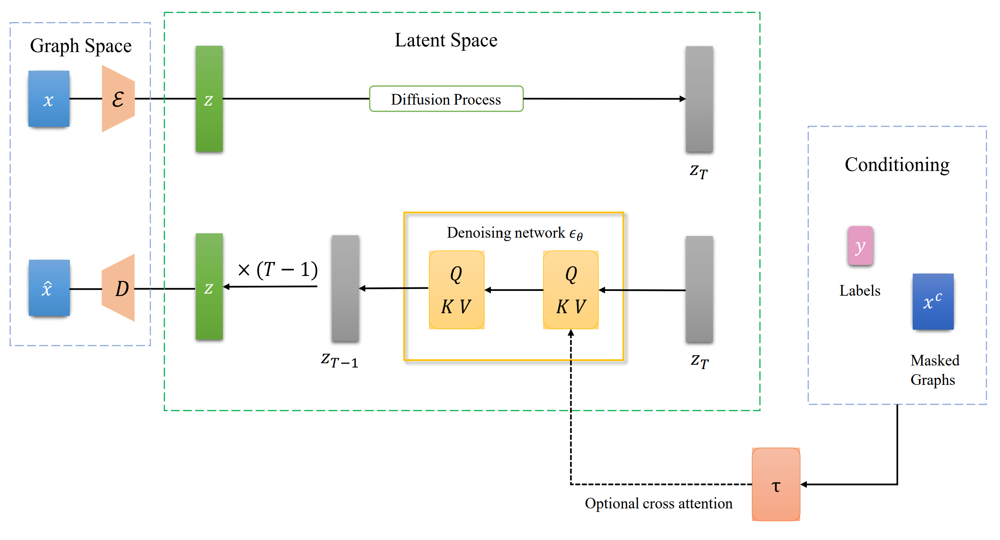

# Latent Graph Diffusion
Official Repository for NeurIPS 2024 Paper Unifying Generation and Prediction on Graphs with Latent Graph Diffusion.



In this paper, we propose the first framework that enables solving graph learning tasks of all levels (node, edge and graph) and all types (generation, regression and classification) using one formulation. We first formulate prediction tasks including regression and classification into a generic (conditional) generation framework, which enables diffusion models to perform deterministic tasks with provable guarantees. We then propose Latent Graph Diffusion (LGD), a generative model that can generate node, edge, and graph-level features of all categories simultaneously. We achieve this goal by embedding the graph structures and features into a latent space leveraging a powerful encoder and decoder, then training a diffusion model in the latent space. LGD is also capable of conditional generation through a specifically designed cross-attention mechanism. Leveraging LGD and the ``all tasks as generation'' formulation, our framework is capable of solving graph tasks of various levels and types. We verify the effectiveness of our framework with extensive experiments, where our models achieve state-of-the-art or highly competitive results across a wide range of generation and regression tasks.

### Python environment setup with Conda

We build our code based on [GraphGPS](https://github.com/rampasek/GraphGPS) with many modification and improvements, including combining it with DDPM.

```bash
conda create -n lgd python=3.9
conda activate lgd

conda install pytorch=1.10 torchvision torchaudio -c pytorch -c nvidia
conda install pyg=2.0.4 -c pyg -c conda-forge

# RDKit is required for OGB-LSC PCQM4Mv2 and datasets derived from it.  
conda install openbabel fsspec rdkit -c conda-forge

pip install torchmetrics
pip install performer-pytorch
pip install ogb
pip install tensorboardX
pip install wandb

conda clean --all
```

### Running LGD

```bash
conda activate lgd

# An example to run experiments on Zinc dataset; change the configs files to run other experiments on different datasets with desired hyperparameters
# The commands are all in cfg/xxx.sh, and the configurations are set in cfg/xxx.yaml

# The first step is to pretrain an autoencoder
python pretrain.py --cfg cfg/zinc-encoder.yaml --repeat 5 wandb.use False

# Then train LGD
python train_diffusion.py --cfg cfg/zinc-diffusion_ddpm.yaml --repeat 5 wandb.use False

# Remember to change the file path of the checkpoint of the autoencoder in diffusion.first_stage_config

```
